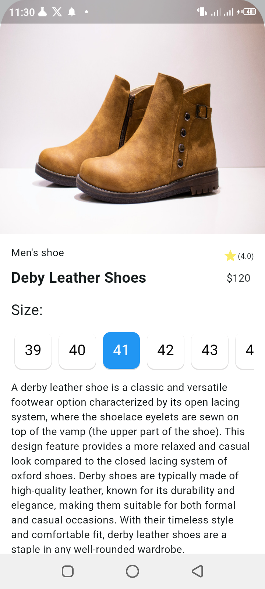

# Flutter UI Design Implementation

## Overview

This project is designed to implement a Flutter user interface based on a reference design provided in a Figma link. The goal is to replicate the design as closely as possible, paying attention to colors, layout, typography, and design elements.

## Project Structure

* **Project Directory**: `mobile/Samuel_Tolossa/ecommers`
* **Repository**: `2024-internship-mobile-tasks`
* **Figma Design Link**: [Figma Link](https://www.figma.com/design/957Md2CrZ2B9KGjHy8RDcH/Internship?node-id=0-1&t=Yrw4etwCj3Z4NKCI-0) 

## Requirements

* **Flutter SDK**: Ensure that you have Flutter SDK installed. You can follow the installation guide [here](https://flutter.dev/docs/get-started/install).
* **Dependencies**: The project uses standard Flutter dependencies. Run `flutter pub get` to install them.

## Implementation Details

### Design Replication

The user interface should closely match the design provided in the Figma link. Focus on:

* **Colors**: Match the color scheme as closely as possible.
* **Layout**: Ensure the layout and positioning of elements are consistent with the design.
* **Typography**: Use the specified fonts, sizes, and weights.
* **Design Elements**: Include any specific design elements such as buttons, icons, and images.

### Widgets and Components

Utilize Flutter widgets and components to build the UI:

* **Container**: For layout and styling.
* **Column & Row**: For arranging widgets vertically and horizontally.
* **Image**: To display images.
* **Text**: For displaying text.
* **Button**: For interactive elements.

## Task Verification

* **Project Naming**: Ensure the project is named correctly as specified.
* **Screenshots**: Take screenshots of the UI and add them when creating a pull request (PR). Below are the images of the implemented UI:

  
  
  
  
  
  
* **GitHub Links**: Attach the GitHub links to the progress sheet as required.
