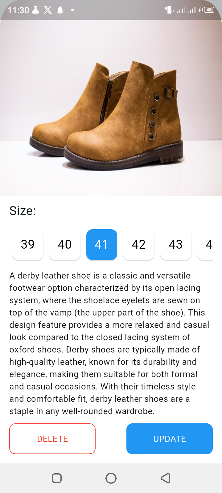
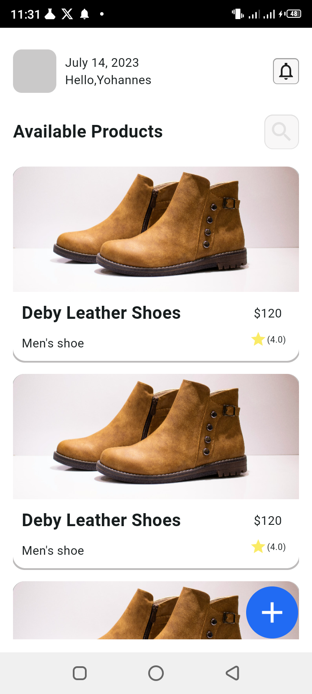
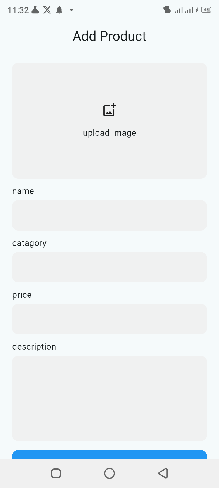
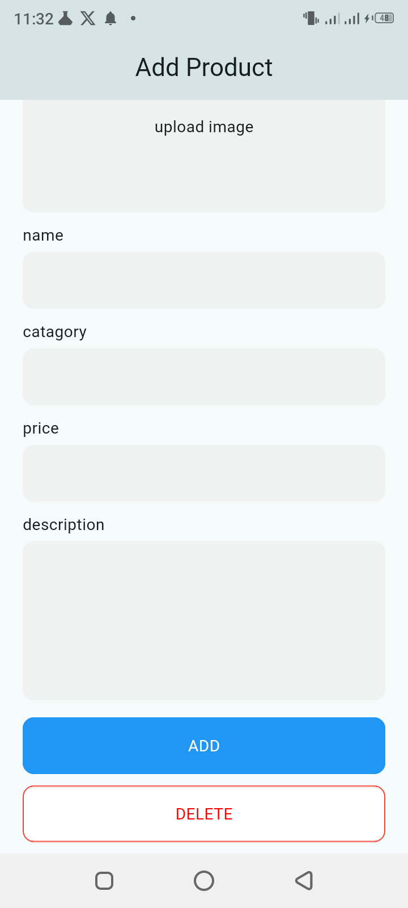
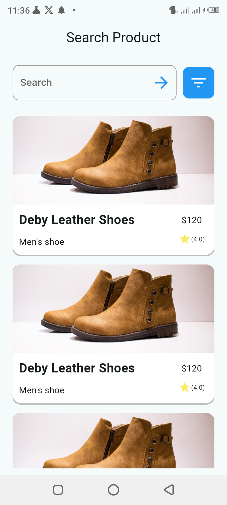

# Flutter UI Design Implementation

## Overview

This project is designed to implement a Flutter user interface based on a reference design provided in a Figma link. The goal is to replicate the design as closely as possible, paying attention to colors, layout, typography, and design elements.

## Project Structure

* **Project Directory** : `mobile/Samuel_Tolossa/ecommers`
* **Repository** : `2024-internship-mobile-tasks`
* **Figma Design Link** : [Figma Link](https://www.figma.com/design/957Md2CrZ2B9KGjHy8RDcH/Internship?node-id=0-1&t=Yrw4etwCj3Z4NKCI-0)

## Requirements

* **Flutter SDK** : Ensure that you have Flutter SDK installed. You can follow the installation guide [here](https://flutter.dev/docs/get-started/install).
* **Dependencies** : The project uses standard Flutter dependencies. Run `flutter pub get` to install them.

## Implementation Details

### Design Replication

The user interface should closely match the design provided in the Figma link. Focus on:

* **Colors** : Match the color scheme as closely as possible.
* **Layout** : Ensure the layout and positioning of elements are consistent with the design.
* **Typography** : Use the specified fonts, sizes, and weights.
* **Design Elements** : Include any specific design elements such as buttons, icons, and images.

### Widgets and Components

Utilize Flutter widgets and components to build the UI:

* **Container** : For layout and styling.
* **Column & Row** : For arranging widgets vertically and horizontally.
* **Image** : To display images.
* **Text** : For displaying text.
* **Button** : For interactive elements.

## Task Verification

* **Project Naming** : Ensure the project is named correctly as specified.
* **Screenshots** :
* 
* 
* 
* 
* 
* 

## Clean Architecture Structure

### Project Directory 

### Main Directory Structure

- - - Certainly! Here's a tree representation of the directory structure along with a brief description for each part in a `README.md` format:

      <pre>

markdown
<button class="flex gap-1 items-center"><svg xmlns="http://www.w3.org/2000/svg" width="24" height="24" fill="none" viewBox="0 0 24 24" class="icon-sm"><path fill="currentColor" fill-rule="evenodd" d="M7 5a3 3 0 0 1 3-3h9a3 3 0 0 1 3 3v9a3 3 0 0 1-3 3h-2v2a3 3 0 0 1-3 3H5a3 3 0 0 1-3-3v-9a3 3 0 0 1 3-3h2zm2 2h5a3 3 0 0 1 3 3v5h2a1 1 0 0 0 1-1V5a1 1 0 0 0-1-1h-9a1 1 0 0 0-1 1zM5 9a1 1 0 0 0-1 1v9a1 1 0 0 0 1 1h9a1 1 0 0 0 1-1v-9a1 1 0 0 0-1-1z" clip-rule="evenodd"></path></svg>Copy code</button>

<code class="!whitespace-pre hljs language-markdown"># E-commerce Mobile Application

      This repository contains the codebase for an e-commerce mobile application. The project is organized into different layers to separate concerns and improve maintainability.

      ## Project Structure

      The project is divided into several main directories:

      </code>

</pre>

      ecommerce/
      ├── lib
      │ ├── core
      │ ├── features
      │ │ └── ecommerce
      │ │ ├── Data
      │ │ │ ├── data_source
      │ │ │ ├── model
      │ │ │ └── repositories
      │ │ ├── Domain
      │ │ │ ├── entity
      │ │ │ ├── repositories
      │ │ │ └── usecase
      │ │ └── presentation
      │ │ └── UI
      │ │ ├── add_product
      │ │ ├── home
      │ │ └── searchProduct
      └── main.dart

### Testing Directory Structure

test/
├── Data
│ ├── data_source
│ ├── model
│ └── repositories
├── Domain
│ ├── entity
│ ├── repositories
│ └── use_case
├── features
├── helper

Directory Details

* **lib/main.dart** : Entry point of the Flutter application.
* **lib/core/** : Contains core utilities and configurations used across the project.
* **lib/features/** : Contains all feature-specific code.
* **lib/features/ecommerce/** : The ecommerce feature.
  *  **lib/features/ecommerce/Data/** : Data layer including models, data sources, and repositories.
  *  **lib/features/ecommerce/Domain/** : Domain layer including entities, use cases, and repositories.
  *  **lib/features/ecommerce/UI/** : Presentation layer including widgets, screens, and state management.

### Testing

* **test/features/ecommerce/Data/** : Tests for the Data layer.
* **test/features/ecommerce/Domain/** : Tests for the Domain layer.
* **test/features/ecommerce/Presentation/** : Tests for the Presentation layer.
* **test/features/ecommerce/helper/** : Helper functions and mock data for testing.
